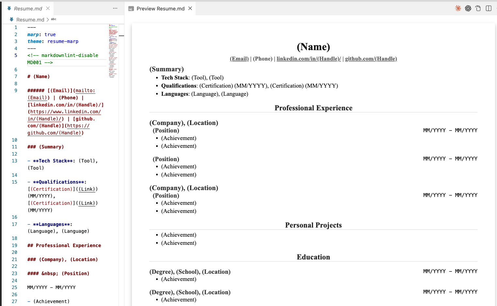

# Marp Resume

You can preview your markdown resume/CV and export PDF using [Marp for VS Code](https://marketplace.visualstudio.com/items?itemName=marp-team.marp-vscode).

This way, you can manage the versions of your resume content separated from the style.

## How to use

1. Install [Marp for VS Code](https://marketplace.visualstudio.com/items?itemName=marp-team.marp-vscode) to VS Code or its compatible forks like Cursor and Antigravity.

2. Fork this repo and clone to your local machine.

3. Open `Resume.md`.

4. Click the preview button to see the long doc-style preview. If you see the wide slide-style preview, make sure `resume-marp.css`, configured in `.vscode/settings.json`, is recognized by [Marp for VS Code](https://marketplace.visualstudio.com/items?itemName=marp-team.marp-vscode) correctly.

5. Run `markdown.marp.export` (`Export Slide Deck`) command to export a PDF.

### Content customization

Modify: `Resume.md`.

### Style customization

Modify: `resume-marp.css`.

## Related repo

If you want to generate resume PDFs using pandoc, see: https://github.com/vidluther/markdown-resume
